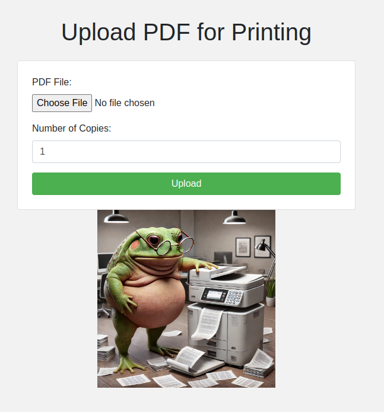

# pi-printy

Pi-printy is a super simple printing web server running on a Raspberry Pi (any linux-based pc). The web server allows you to upload PDF files, which will be further printed by CUPSS library.

The setup is quite straightforward. Can be also extended to handle multiple options like double-sided printing or color printing. However, this very much depends on your printer and also the support in CUPSS.

To make the UI funny, the whole website is frog-themed. 🐸

The project has been tested on Raspberry Pi 5 and Xerox WorkCentre 3025BI printer (for which the CUPSS support is very limited..., hopefully you are luckier :)).

## Installation

1. Clone the repository 
2. 